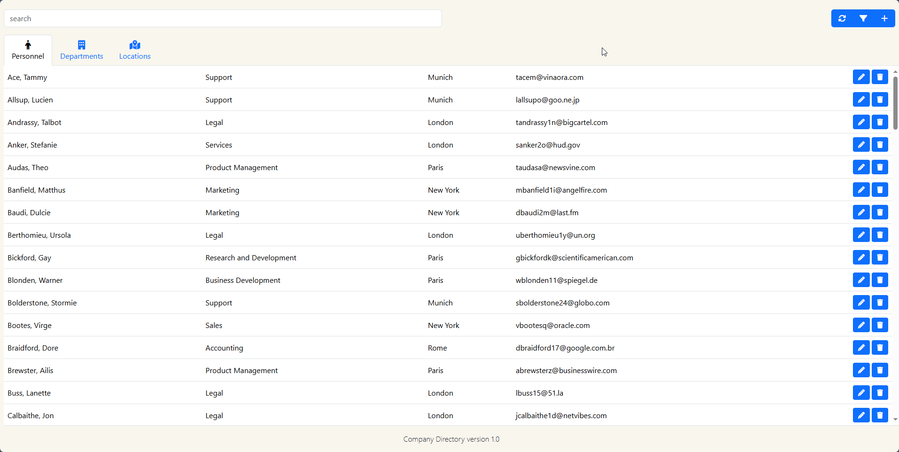
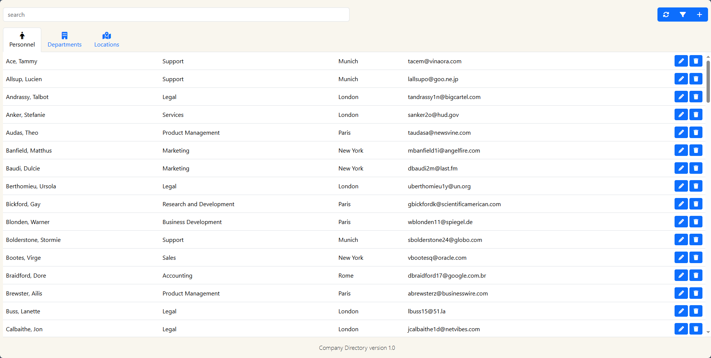
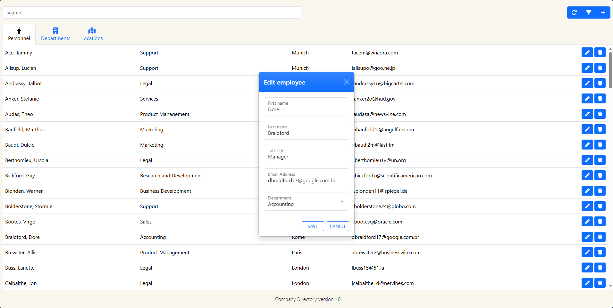
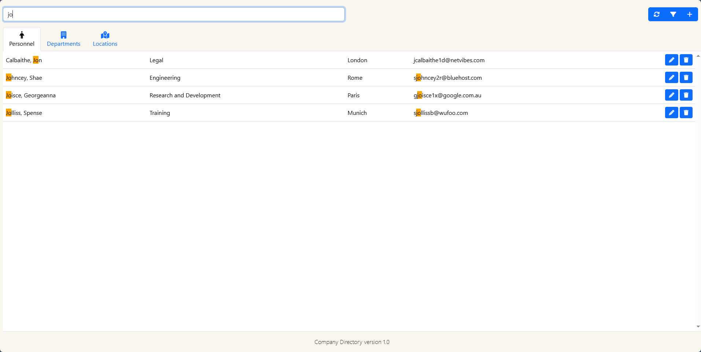
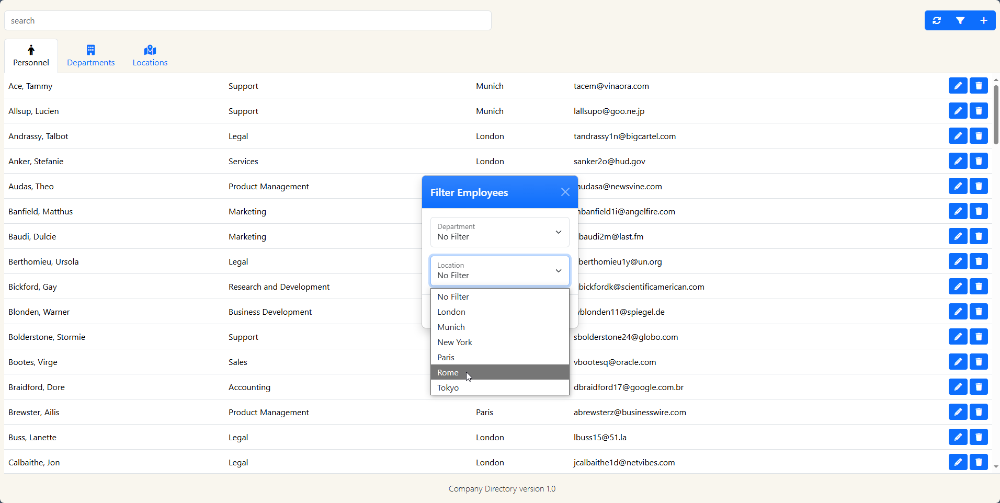
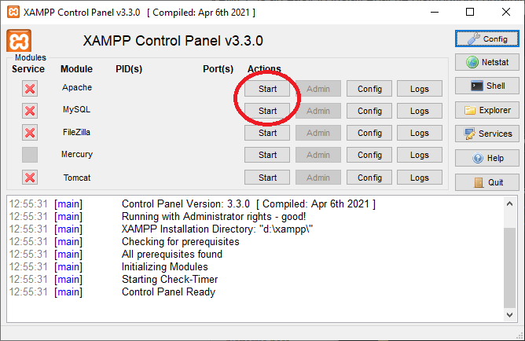

# 🏢 Company Directory

A responsive, searchable company directory built with full-stack web technologies. This project allows users to view, add, and filter employees within an organization using a clean, mobile-first interface. Data is fetched dynamically from a SQL database via PHP and displayed using JavaScript for smooth user interaction.

## 📷 Demo

  

## 🔎 Features

- 📋 **Complete Company Directory** of employees, departments and locations 
- 🔍 **Live Search & Filtering** by employee name, department, location, job role or email
- ➕ **Add & Edit Employees** via a dynamic form
- 💾 **Database-backed data** stored in SQL and retrieved with PHP
- 📱 **Mobile-friendly layout** with fluid design for various screen sizes
- 📡 Asynchronous loading and filtering using JavaScript

## 🛠️ Tech Stack

- **HTML5**, **CSS3**, **Bootstrap** for Frontend structure and styling
- **JavaScript (ES6)**, **AJAX (via jQuery)** for dynamic content loading
- **PHP** for backend logic and database connection
- **MySQL** for employee data storage
- **Responsive design** using media queries
- **Tools**: XAMPP / PHP Built-in Server (for local testing)

## 🖼️ Screenshots

### Employee Directory View


### Employee Details Modal


### 🔎 Live Search


### ➕ Filter Employees Modal


## 📦 Prerequisites

To run this project locally, ensure the following are installed on your machine:

- [Git](https://git-scm.com/downloads)
- [PHP (v7.4+)](https://www.php.net/downloads)
- [XAMPP](https://www.apachefriends.org/download.html) (or MySQL Server)
- [Node.js + npm](https://nodejs.org/)
- A code editor or IDE (e.g., [Visual Studio Code](https://code.visualstudio.com/))

## 🚀 Getting Started

To run this project locally:

1. **Clone the repository**

```bash
git clone https://github.com/MikailMichael/Company-Directory.git
cd Company-Directory
```

2. **Install dependencies**

```bash
npm install
```

3. **Start a local server**

- I will be using XAMPP for this Set-up guide, move the folder into your htdocs/ directory which can be found were you installed XAMPP in XAMPP's root directory called 'xampp'

- Launch XAMPP as administrator, start Apache and MySQL in the XAMPP control panel


4. **Set up the database**

- Open phpMyAdmin by going to `http://localhost/phpmyadmin/`

- Create a new database called companydirectory. The new database should appear in thelist on the left.

-  Click on the database name to select it and then click on the "SQL" tab.

- Paste the contents of the "companydirectorydemo.sql" file located in the project root into the SQL tab and click on "Go".

- You now have a demo database set up to fill the app with some dummy information.

5. **Open the project in your browser**

- Open the app by heading to `http://localhost/Company-Directory/` while XAMPP is still running.